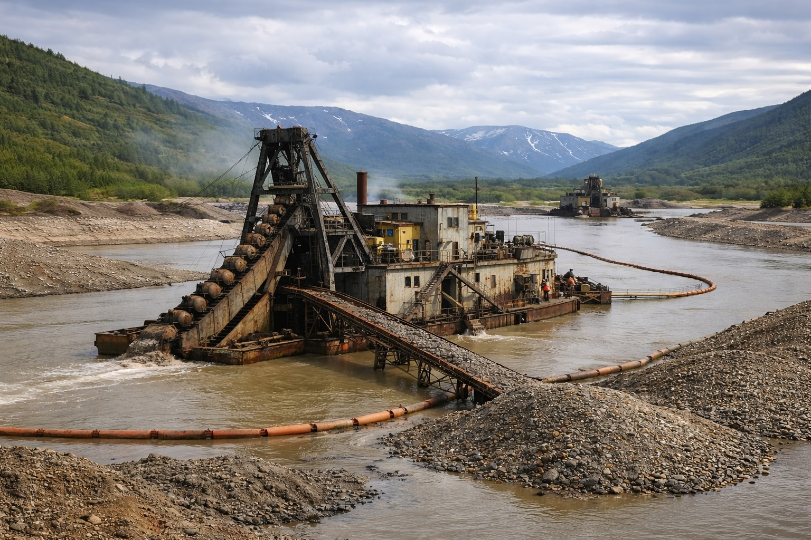
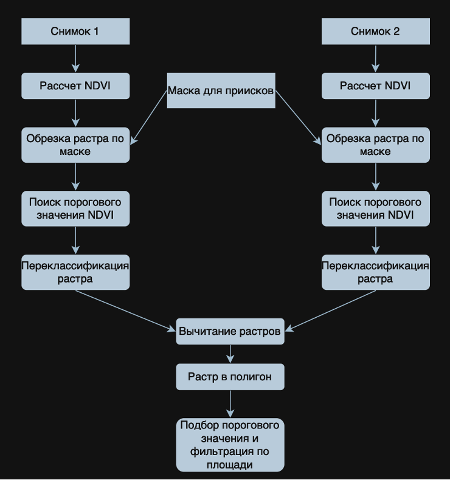
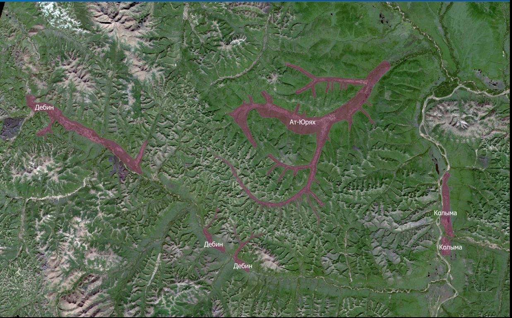
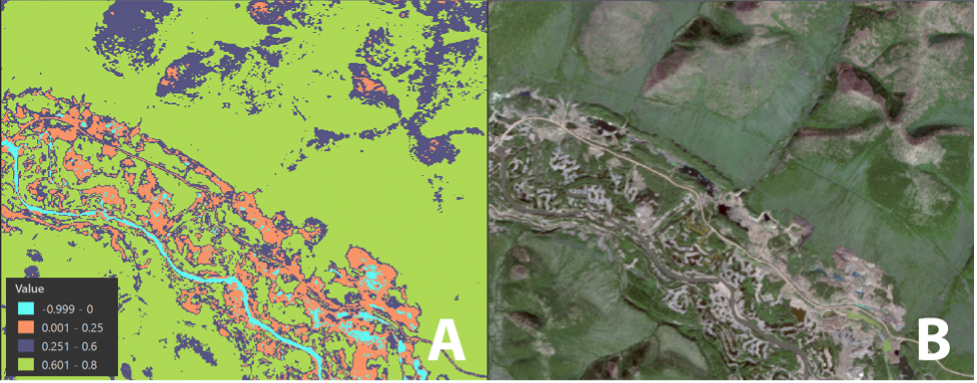

# Мониторинг территорий, нарушенных золотодобычей в Магаданской области  
Sentinel-2 | NDVI | Change Detection | Магаданская область

## 📌 О проекте

Проект посвящён автоматическому выявлению и анализу территорий, нарушенных золотодобычей, на основе спутниковых снимков Sentinel-2 для района Колымы в Магаданской области.
Золотодобыча в регионе ведётся преимущественно промывочным способом, что приводит к:
- разрушению русел рек
- уничтожению растительного покрова
- загрязнению вод взвешенными частицами
- образованию техногенных ландшафтов

**Ключевые результаты**:
- Выявлено увеличение нарушенных территорий на **2217.7 га** (2017–2020) и **1152.9 га** (2020–2023).
- Снижение темпов нарушений на участках Ат-Юрях (−926 га) и Дебин (−395 га), рост на Колыме (+256 га).
- Использован NDVI и фильтрация полигонов.
  

## 🎯 Цель работы
Разработка алгоритма автоматического определения границ районов, нарушенных золотодобычей, на основе спутниковых данных Sentinel-2 и анализа изменения их площади во времени.

## 🛰 Используемые данные
**Спутниковые снимки**
Источник: European Space Agency
Миссия: Sentinel-2

| Спутник	| Уровень |	Дата	| Разрешение |
|-----------|---------|---------|------------|
| Sentinel-2 |	L1C |	2017-08-16 |	10 м |
| Sentinel-2 |	L2A |	2020-09-22 |	10 м |
| Sentinel-2 |	L2A |	2023-07-19 |	10 м |

## Методика
1. Подбор и предобработка данных Sentinel-2 (уровни 1C → 2A с Sen2Cor).
2. Расчёт NDVI и классификация (Reclassify, порог 0.3 для нарушенных зон).
3. Создание маски приисков (6 участков) на основе визуального анализа 2023 г.
4. Обрезка растров по маске → вычитание (Raster Calculator) для change detection.
5. Конвертация в полигоны → фильтрация по площади (>1 га) для удаления шума.
6. Анализ динамики площадей по участкам.

## Результаты и визуализация

#### Динамика площадей (га)
| Участок    | 2017–2020 | 2020–2023 | Изменение |
|------------|-----------|-----------|-----------|
| Ат-Юрях   | 1403.1   | 477.1    | −926     |
| Дебин     | 755.9    | 360.4    | −395     |
| Колыма    | 58.7     | 315.4    | +256     |
| **Сумма** | **2217.7**| **1152.9**| −1065  |

### 📈 Основные выводы:
Общая площадь новых нарушений снизилась после 2020 года
Наблюдается значительное сокращение темпов на Ат-Юрях и Дебине
Увеличение активности на Колыме

Выделенные маской прииски

Классифицированный NDVI (A) и синтезированный RGB снимок (В) за 2017 год

Изменение площади нарушенных земель на участке Ат-Юрях с 2017 по 2020 гг.

## Возможное применение
- Экологический мониторинг золотодобычи.
- Оценка интенсивности добычи для регуляторов / компаний.
- Планирование рекультивации.

## Контакты
Егор Вяткин  
📧 egrvyatkin@gmail.com  
GitHub: [@egrvtkn](https://github.com/egrvtkn)  
Телефон: +7 (902) 999-43-99
